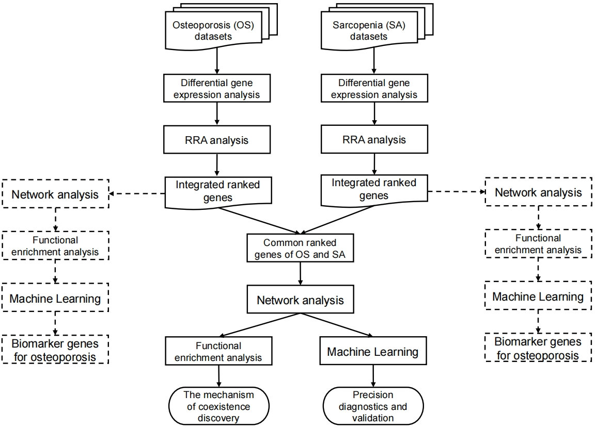

# A systems biology approach to elucidate the association between osteoporosis and sarcopenia

## Overall workflow

## Tutorial

### Module 1. Differential gene expression analysis

Please use the [degs_analysis.Rmd](./degs_analysis.Rmd) script in R or Rstudio.

### Module 2. Robust Rank Aggregation (RRA)

Please use the [RRA_intersection.Rmd](RRA_intersection.Rmd) script in R or Rstudio.

### Module 3. Network analysis

Please use [STRING](https://string-db.org) and [Cytoscape](https://cytoscape.org) for the network analysis.

### Module 4. Functional enrichment analysis

Please use the [functional_enrichment_analysis.Rmd](functional_enrichment_analysis.Rmd) script in R or Rstudio.

### Module 5. Machine learning framework

The machine learning module of this study was implemented in Python. For convienence of the users, please use the [machine_learning_classifier.ipynb](machine_learning_classifier.ipynb) script in Jupyter.

## Citation

Our manuscript, titled *"Systems biology and experimental validation indicate DDIT4, FOXO1, and STAT3 as shared key genes linking osteoporosis and sarcopenia"* has been submitted to [Frontiers in Genetics](https://www.frontiersin.org/journals/genetics) for peer review.

## Contact

Renjie Tan (renjie.tan at hrbmu.edu.cn) 
